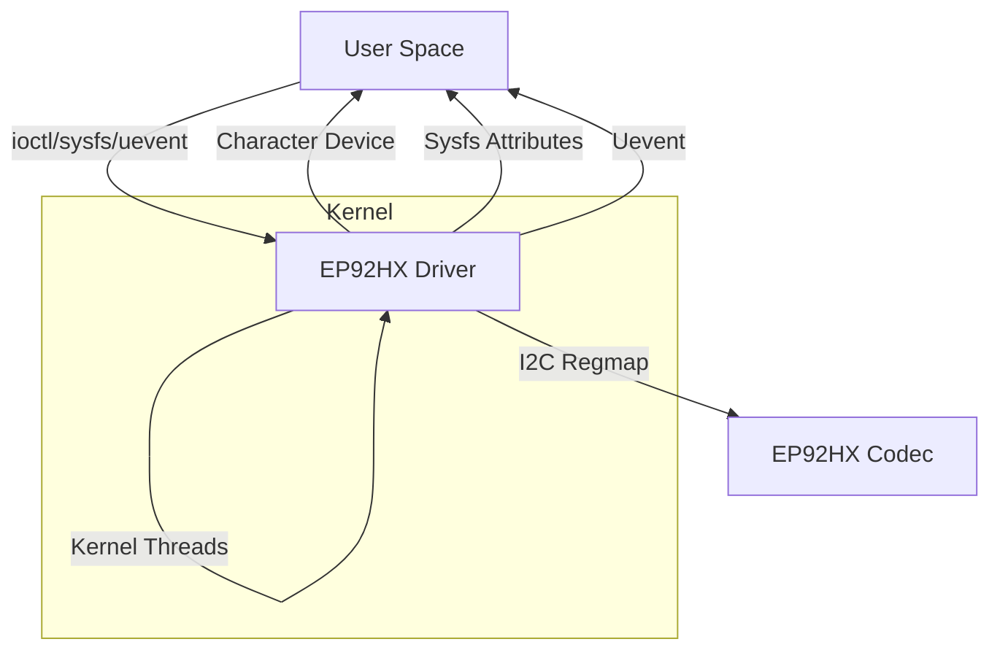

# EP92HX eARC Audio Kernel Driver

## Overview

This Linux kernel driver provides support for the EP92HX audio codec, enabling configuration and management of the eARC (enhanced Audio Return Channel) audio interface via I2C. The driver is designed for NVIDIA platforms and manages both eARC and ARC (Audio Return Channel) use cases, including CEC (Consumer Electronics Control) communication and ISP programming for firmware updates.

## Purpose

- **Configure and control the eARC interface** on the EP92HX codec through its SA IF microcontroller.
- **Handle CEC communication** between the SoC and EP92HX.
- **Support ISP programming** to flash firmware to the EP92HX.
- **Expose audio and hotplug status** to userspace via sysfs and uevents.
- **Provide a character device interface** for user-space control and querying of audio parameters and capabilities.

## High-Level Design

### Architecture

- **I2C Client Driver**: Registers as an I2C driver and communicates with the EP92HX codec over I2C.
- **Regmap API**: Uses Linux regmap for register access abstraction.
- **Kernel Threads**: Spawns polling threads to monitor hotplug and audio status registers for both eARC Rx and Tx.
- **Character Device**: Exposes a `/dev/earc_audio_dev` device for user-space IOCTLs.
- **Sysfs Attributes**: Exposes hotplug status via sysfs (`rx_hpd`, `tx_hpd`).
- **Uevents**: Sends uevents to userspace on HPD (Hot Plug Detect) and audio format changes.

### Key Data Structures

- `struct earc_driver_data`: Holds all runtime state, including I2C client, regmap, polling threads, audio parameters, and wait queues.
- `struct earc_tx_params`, `struct earc_rx_params`, `struct earc_sink_cap`: Hold audio format and capability information.

### Register Map

All register and bit definitions are in `ep92hx.h`, mapping the EP92HX's SA IF register set.

## Driver Call Flow

### Initialization

1. **Probe (`earc_i2c_probe`)**
   - Allocates and initializes `earc_driver_data`.
   - Sets up regmap for register access.
   - Configures initial codec registers.
   - Creates polling threads for hotplug and status monitoring.
   - Registers character device and sysfs attributes.

2. **Polling Threads**
   - `poll_hpd_regs`: Monitors hotplug status for Rx and Tx, triggers further processing on changes.
   - `monitor_earc_rx_regs` / `monitor_earc_tx_regs`: Monitor detailed status and audio format changes for Rx/Tx.

3. **Sysfs and Uevents**
   - Sysfs attributes (`rx_hpd`, `tx_hpd`) provide current hotplug status.
   - Uevents are sent to userspace on HPD and audio format changes.

### Runtime Operation

- **Audio Parameter Configuration**
  - User-space configures audio output via IOCTLs on `/dev/earc_audio_dev`.
  - Driver programs the appropriate registers for format, sample rate, channel count, etc.
  - Audio output is enabled/disabled as requested.

- **Capability Query**
  - User-space can query the current sink (Rx) audio capabilities via IOCTL.
  - Driver reads and parses the capability registers, returning the data to user-space.

- **Hotplug and Status Monitoring**
  - Polling threads detect changes in hotplug or audio status.
  - On change, driver updates internal state, notifies user-space via uevent, and updates sysfs.

### Removal

- **Remove (`earc_i2c_remove`)**
  - Stops all polling threads.
  - Cleans up character device, sysfs, and class/device structures.

## Top-Level Design Diagram

## File Structure

- `ep92hx.c`: Main driver implementation.
- `ep92hx.h`: Register and bit definitions, public API.
- `/dev/earc_audio_dev`: Character device for user-space control.
- Sysfs: `/sys/class/earc_audio_class/earc_audio_dev/rx_hpd`, `/tx_hpd`.

## IOCTL Interface

The driver supports IOCTLs for:
- Setting Tx audio parameters
- Enabling/disabling SPDIF output
- Querying sink capabilities
- Stopping Tx/Rx audio
- Querying Rx audio parameters

(See `uapi/misc/ep_earc_audio_ioctl.h` for details.)

## Events and Notifications

- **Uevents**: Sent on HPD (hotplug) and audio format changes.
- **Sysfs**: Exposes current hotplug status.

## Dependencies

- Linux kernel I2C, regmap, and character device APIs.
- Platform must provide the EP92HX codec on an accessible I2C bus.

## Authors

- Aditya Bavanari <abavanari@nvidia.com>
