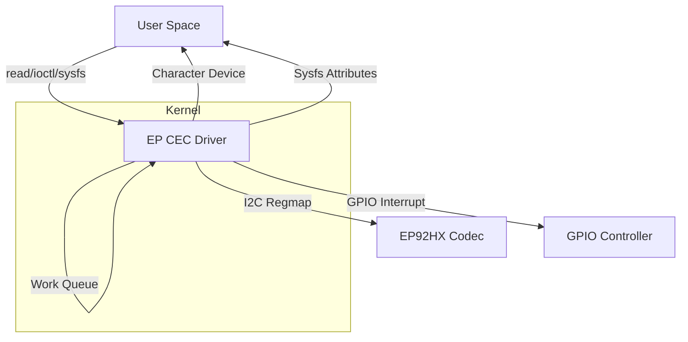

# EP92HX CEC Kernel Driver

## Overview

This Linux kernel driver provides support for the Consumer Electronics Control (CEC) functionality on the EP92HX chip, enabling HDMI CEC communication via I2C. The driver is designed for NVIDIA platforms and manages CEC message transmission and reception, including physical and logical address configuration, interrupt handling, and user-space communication.

## Purpose

- **Configure and control the CEC interface** on the EP92HX codec through its SA IF microcontroller.
- **Handle CEC message transmission and reception** between connected HDMI devices.
- **Manage physical and logical address configuration** for CEC device identification.
- **Provide GPIO interrupt handling** for CEC message reception.
- **Expose CEC status and configuration** to userspace via sysfs and character device interface.
- **Support power management** with suspend/resume functionality.

## High-Level Design

### Architecture

- **I2C Client Driver**: Registers as an I2C driver and communicates with the EP92HX codec over I2C.
- **Regmap API**: Uses Linux regmap for register access abstraction.
- **GPIO Interrupt Handling**: Uses GPIO interrupt to detect incoming CEC messages.
- **Work Queue**: Processes CEC messages in process context via work queue.
- **Character Device**: Exposes a `/dev/explore_cec` device for user-space read operations.
- **Poll Interface**: Supports poll/select for efficient event-driven CEC message reading.
- **Sysfs Attributes**: Exposes CEC configuration via sysfs (`ep_cec_physical_addr`, `ep_cec_logical_addr`, `ep_cec_disable`).
- **Ring Buffer**: Uses kfifo for buffering incoming CEC messages.

### Key Data Structures

- `struct explore_cec`: Holds all runtime state, including I2C client, regmap, GPIO descriptor, work queue, and message buffer.
- `struct ep_cec_message`: Represents a CEC message with 18-byte data array.

### Register Map

All register and bit definitions are in `ep_cec.h`, mapping the EP92HX's CEC register set including system control, feature control, command buffer, and event buffer registers.

## Driver Call Flow

### Initialization

1. **Probe (`explore_cec_probe`)**
   - Allocates and initializes `explore_cec` structure.
   - Sets up regmap for register access.
   - Configures initial CEC registers and disables CEC on eARC device.
   - Creates misc device for user-space access.
   - Sets up GPIO interrupt for CEC message detection.
   - Initializes work queue and message ring buffer.
   - Creates sysfs attributes.

2. **Hardware Initialization (`explore_cec_hw_init`)**
   - Configures feature control register.
   - Waits for command completion.
   - Disables CEC on the eARC device initially.

3. **GPIO Interrupt Setup (`ep_cec_setup_gpio_irq`)**
   - Gets GPIO descriptor from device tree.
   - Configures GPIO interrupt with falling edge trigger.
   - Registers interrupt handler.

### Runtime Operation

- **CEC Message Reception**
  - GPIO interrupt triggers on falling edge.
  - Interrupt handler schedules work queue.
  - Work handler reads interrupt flags and CEC message data.
  - Message is stored in ring buffer for user-space consumption.

- **User-Space Interface**
  - User-space can read CEC messages via `/dev/explore_cec`.
  - Poll/select support for efficient event-driven message reading.
  - Physical and logical addresses can be configured via sysfs.
  - Register dump functionality available via ioctl.

- **Power Management**
  - Suspend: Disables CEC on eARC device, enables IRQ wake.
  - Resume: Re-enables CEC on eARC device, disables IRQ wake.

### Removal

- **Remove (`explore_cec_remove`)**
  - Cancels pending work queue.
  - Destroys mutex and sysfs attributes.
  - Deregisters misc device.

## Top-Level Design Diagram

## File Structure

- `ep_cec.c`: Main driver implementation.
- `ep_cec.h`: Register and bit definitions, driver data structures.
- `/dev/explore_cec`: Character device for user-space CEC message reading.
- Sysfs: `/sys/class/misc/explore_cec/ep_cec_physical_addr`, `/ep_cec_logical_addr`, `/ep_cec_disable`.

## IOCTL Interface

The driver supports IOCTLs for:
- Dumping CEC register contents (`EP_CEC_IOCTL_DUMP_REG`)

(See `uapi/misc/ep_cec.h` for details.)

## Poll Interface

The driver supports poll/select for efficient event-driven CEC message reading:

- **Poll Behavior**:
  - Returns `POLLIN | POLLRDNORM` immediately if CEC message buffer contains messages (>0)
  - Blocks and waits for timeout if buffer is empty (=0)
  - Wakes up waiting processes when new CEC messages arrive via GPIO interrupt

- **Usage**: Applications can use `select`, `poll()` system calls to wait for CEC messages without busy polling

- **Timeout Support**: Respects the timeout parameter passed to poll/select calls
- **Timeout Recommendation**: Minimum timeout of 50ms is recommended for optimal performance

## Sysfs Interface

The driver exposes the following sysfs attributes:
- `ep_cec_physical_addr`: Read/write CEC physical address (0x0000-0xFFFF)
- `ep_cec_logical_addr`: Read/write CEC logical address (0x00-0x0F)
- `ep_cec_disable`: Read-only CEC disable status (debug builds allow write)

## Events and Notifications

- **GPIO Interrupts**: Triggered on falling edge for CEC message reception.
- **Work Queue**: Processes CEC messages in process context.
- **Ring Buffer**: Buffers up to 32 CEC messages for user-space consumption.
- **Wait Queue**: Supports poll/select for efficient event-driven message notification.

## Dependencies

- Linux kernel I2C, regmap, GPIO, and misc device APIs.
- Platform must provide the EP92HX codec on an accessible I2C bus.
- GPIO interrupt line must be configured in device tree.
- Requires eARC driver (`ep92hx`) for CEC disable functionality.

## Power Management

The driver supports suspend/resume operations:
- **Suspend**: Disables CEC on EP92H1 and enables IRQ wake for wake-on-CEC.
- **Resume**: Re-enables CEC on EP92H1 and disables IRQ wake.

## Authors

- Devin Dai <wedai@nvidia.com>